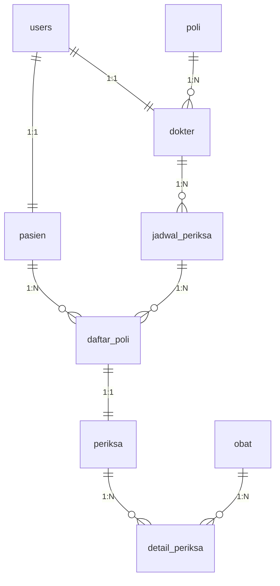

---

<div align="center">
  


</div>

---

## 🚀 Overview

Selamat datang di **Poliklinikikuk** - sebuah sistem informasi poliklinik modern yang dirancang untuk mempermudah pengelolaan layanan kesehatan. Aplikasi ini menggabungkan kekuatan Laravel dengan keindahan AdminLTE untuk memberikan pengalaman pengguna yang luar biasa!

### 🎯 Apa yang Membuat Aplikasi Ini Istimewa?

- 🔐 **Multi-Role Authentication** - Admin, Dokter, dan Pasien punya dashboard masing-masing
- 📱 **Responsive Design** - Cantik di semua device
- ⚡ **Real-time Features** - Status jadwal dokter yang update secara live
- 🎨 **AdminLTE Interface** - UI yang professional dan modern
- 🔄 **Auto-generated** - Nomor RM pasien otomatis dan sistem antrian pintar

---

## 🏗️ Arsitektur & Technology Stack

### 🛠️ Core Technologies

```bash
🐘 PHP 8.2+               # Backend powerhouse
🎯 Laravel 12.0           # The PHP framework for web artisans
🎨 AdminLTE 3.2           # Beautiful admin template
🗄️ MySQL 8.0+            # Reliable database
🌐 HTML5 + CSS3 + JS      # Frontend trio
📦 Composer               # Dependency management
```

### 📁 Project Structure

```
📂 Poliklinikikuk/
├── 🎮 app/
│   ├── 📋 Http/Controllers/
│   │   ├── 🔐 Auth/AuthController.php
│   │   ├── 👨‍💼 AdminController.php
│   │   ├── 👨‍⚕️ DokterController.php
│   │   └── 🏥 PasienController.php
│   │
│   ├── 📊 Models/
│   │   ├── 👤 User.php
│   │   ├── 🏥 Poli.php
│   │   ├── 👨‍⚕️ Dokter.php
│   │   ├── 👨‍👩‍👧‍👦 Pasien.php
│   │   ├── 📅 JadwalPeriksa.php
│   │   ├── 📝 DaftarPoli.php
│   │   ├── 🔍 Periksa.php
│   │   ├── 💊 Obat.php
│   │   └── 📋 DetailPeriksa.php
│   │
│   └── 🛡️ Providers/
│       └── AppServiceProvider.php
│
├── 🗄️ database/migrations/
│   ├── 2025_06_14_173003_reset_database_structure.php
│   └── 2025_06_14_174432_create_users_table_new.php
│
├── 🎨 resources/views/
│   ├── 🔐 auth/
│   ├── 👨‍💼 admin/
│   ├── 👨‍⚕️ dokter/
│   └── 🏥 pasien/
│
└── 🛣️ routes/web.php
```

---

## 👥 User Roles & Permissions

### 🔴 Admin (Super User)
```php
🎯 Dashboard analytics lengkap
📊 Manajemen data master:
   ├── 🏥 Poliklinik (CRUD)
   ├── 👨‍⚕️ Dokter (CRUD + Auto user creation)
   ├── 👨‍👩‍👧‍👦 Pasien (CRUD + Auto RM generation)
   └── 💊 Obat (CRUD)
🔧 System configuration
```

### 🔵 Dokter (Medical Staff)
```php
🏠 Dashboard personal
📅 Jadwal Management:
   ├── ➕ Buat jadwal praktek
   ├── ✏️ Edit jadwal (dengan validasi waktu)
   ├── 🔄 Aktivasi/deaktivasi jadwal
   └── 📊 Real-time status monitoring
🩺 Pemeriksaan Pasien:
   ├── 📋 Queue management
   ├── 📝 Input hasil pemeriksaan
   ├── 💊 Resep obat
   └── 💰 Kalkulasi biaya otomatis
💊 Manajemen Obat personal
👤 Profil & password management
```

### 🔵 Pasien (End User)
```php
🏠 Dashboard informasi
📝 Pendaftaran online:
   ├── 🏥 Pilih poli
   ├── 👨‍⚕️ Pilih dokter
   ├── 📅 Pilih jadwal
   └── 📄 Input keluhan
📊 Sistem antrian otomatis
📚 Riwayat pemeriksaan lengkap
👤 Profil management
```

---

## 🗄️ Database Schema

### 📊 ERD Overview



### 🏗️ Core Tables

#### 👤 **users** - Authentication Hub
```sql
📋 Columns:
├── id (Primary Key)
├── email (Unique, Max: 50)
├── password (Hashed)
├── role (Enum: admin, dokter, pasien)
├── entity_id (Foreign Key ke dokter/pasien)
└── timestamps
```

#### 🏥 **poli** - Poliklinik Master
```sql
📋 Columns:
├── id (Primary Key)
├── nama_poli (String, Max: 25)
├── keterangan (Text, Nullable)
└── timestamps
```

#### 👨‍⚕️ **dokter** - Doctor Management
```sql
📋 Columns:
├── id (Primary Key)
├── nama (String, Max: 150)
├── alamat (String, Max: 255, Nullable)
├── no_hp (String, Max: 15)
├── id_poli (Foreign Key → poli.id)
└── timestamps
```

#### 👨‍👩‍👧‍👦 **pasien** - Patient Registry
```sql
📋 Columns:
├── id (Primary Key)
├── nama (String, Max: 150)
├── alamat (String, Max: 255)
├── no_ktp (String, 16 digits, Unique)
├── no_hp (String, Max: 15)
├── no_rm (String, Max: 10, Auto-generated)
└── timestamps
```

#### 📅 **jadwal_periksa** - Schedule Management
```sql
📋 Columns:
├── id (Primary Key)
├── id_dokter (Foreign Key → dokter.id)
├── hari (Enum: Senin-Minggu)
├── jam_mulai (Time)
├── jam_selesai (Time)
├── aktif (Boolean, Default: true)
└── timestamps

🔒 Unique Constraint: [id_dokter, hari, jam_mulai]
```

#### 📝 **daftar_poli** - Registration Queue
```sql
📋 Columns:
├── id (Primary Key)
├── id_pasien (Foreign Key → pasien.id)
├── id_jadwal (Foreign Key → jadwal_periksa.id)
├── keluhan (Text)
├── no_antrian (Integer, Auto-increment)
├── status (Enum: menunggu, sedang_diperiksa, selesai, batal)
├── tanggal_daftar (Date)
└── timestamps
```

#### 🔍 **periksa** - Medical Examination
```sql
📋 Columns:
├── id (Primary Key)
├── id_daftar_poli (Foreign Key → daftar_poli.id)
├── tgl_periksa (Date)
├── catatan (Text)
├── biaya_periksa (Integer, Auto-calculated)
└── timestamps
```

#### 💊 **obat** - Medicine Catalog
```sql
📋 Columns:
├── id (Primary Key)
├── nama_obat (String, Max: 50)
├── kemasan (String, Max: 35)
├── harga (Integer, Min: 0)
└── timestamps
```

#### 📋 **detail_periksa** - Prescription Details
```sql
📋 Columns:
├── id (Primary Key)
├── id_periksa (Foreign Key → periksa.id)
├── id_obat (Foreign Key → obat.id)
└── timestamps
```

---

## 🛣️ Routing Architecture

### 🔐 Authentication Routes
```php
📍 Public Routes:
├── GET  /              → Landing page
├── GET  /login         → Login form
├── POST /login         → Login process
├── GET  /register      → Registration form
├── POST /register      → Registration process
└── POST /logout        → Logout process
```

### 👨‍💼 Admin Routes (`/admin/*`)
```php
🔒 Middleware: ['auth', 'role:admin']

📊 Dashboard:
└── GET /dashboard → AdminController@dashboard

🏥 Poli Management:
├── GET    /poli     → indexPoli
├── POST   /poli     → storePoli
├── PUT    /poli/{id} → updatePoli
└── DELETE /poli/{id} → destroyPoli

👨‍⚕️ Dokter Management:
├── GET    /dokter     → indexDokter
├── POST   /dokter     → storeDokter
├── PUT    /dokter/{id} → updateDokter
└── DELETE /dokter/{id} → destroyDokter

👨‍👩‍👧‍👦 Pasien Management:
├── GET    /pasien     → indexPasien
├── POST   /pasien     → storePasien
├── PUT    /pasien/{id} → updatePasien
└── DELETE /pasien/{id} → destroyPasien

💊 Obat Management:
├── GET    /obat     → indexObat
├── POST   /obat     → storeObat
├── PUT    /obat/{id} → updateObat
└── DELETE /obat/{id} → destroyObat
```

### 👨‍⚕️ Dokter Routes (`/dokter/*`)
```php
🔒 Middleware: ['auth', 'role:dokter']

📊 Dashboard:
└── GET /dashboard → DokterController@dashboard

📅 Jadwal Management:
├── GET /jadwal → jadwal (List & Create)
├── POST /jadwal → jadwalStore
├── PUT /jadwal/{id} → jadwalUpdate
├── PUT /jadwal/{id}/activate → jadwalActivate
└── GET /jadwal/status → jadwalStatus (AJAX)

🩺 Pemeriksaan:
├── GET /periksa → periksa (Queue list)
├── GET /periksa/{daftarPoliId}/edit → periksaEdit
├── PUT /periksa/{daftarPoliId} → periksaUpdate
└── GET /periksa/{periksaId}/show → periksaShow

💊 Obat Management:
├── GET    /obat     → obat
├── POST   /obat     → obatStore
├── PUT    /obat/{id} → obatUpdate
└── DELETE /obat/{id} → obatDestroy

👤 Profil:
├── GET /profil → profil
├── PUT /profil → profilUpdate
└── PUT /password → passwordUpdate
```

### 🏥 Pasien Routes (`/pasien/*`)
```php
🔒 Middleware: ['auth', 'role:pasien']

📊 Dashboard:
└── GET /dashboard → PasienController@dashboard

📝 Pendaftaran:
├── GET /daftar → daftar (Registration form)
├── POST /daftar → daftarStore
├── GET /daftar/jadwal/{poliId} → getJadwalByPoli (AJAX)
└── DELETE /daftar/{id}/cancel → daftarCancel

📋 Pemeriksaan:
├── GET /periksa → periksa (Queue status)
└── GET /riwayat → riwayat (Medical history)

👤 Profil:
├── GET /profil → profil
├── PUT /profil → profilUpdate
└── PUT /password → passwordUpdate
```

---

## ⚡ Key Features & Innovations

### 🔥 Advanced Features

#### 🕐 **Smart Time Management**
```php
🌟 Real-time Jadwal Status:
├── ⏰ Live operational status checking
├── 🔄 Auto status updates (Belum Mulai → Sedang Berlangsung → Selesai)
├── ⚠️ Conflict detection untuk jadwal overlap
└── 📊 AJAX status monitoring tanpa refresh
```

#### 🎯 **Intelligent Queue System**
```php
🌟 Auto Queue Management:
├── 📊 Automatic queue number generation
├── 🔄 Dynamic queue reordering
├── 📱 Real-time queue status updates
└── ⏭️ Smart queue advancement
```

#### 💰 **Auto Cost Calculation**
```php
🌟 Biaya Otomatis:
├── 💊 Harga obat auto-sum dari resep
├── 🏥 Biaya konsultasi (configurable)
├── 📊 Total biaya real-time calculation
└── 💳 Invoice generation ready
```

#### 🔐 **Advanced Security**
```php
🌟 Security Features:
├── 🛡️ Role-based access control (RBAC)
├── 🔒 Password hashing dengan bcrypt
├── 🚫 CSRF protection on all forms
├── ✅ Input validation & sanitization
└── 🔍 XSS protection via Laravel
```

### 🎨 **UI/UX Innovations**

#### 📱 **Responsive Design**
- 💻 Desktop-first approach dengan mobile adaptation
- 📱 Touch-friendly interface untuk tablet/mobile
- 🎨 AdminLTE 3.2 dengan custom branding
- 🌈 Color-coded status indicators

#### ⚡ **Performance Optimizations**
- 🚀 Lazy loading untuk data tables
- 📊 AJAX-powered dynamic content
- 💾 Efficient database queries dengan Eloquent relationships
- 🔄 Optimized asset loading

---

## 🛠️ Installation & Setup

### 📋 Prerequisites

```bash
✅ PHP 8.2 atau lebih baru
✅ Composer 2.x
✅ MySQL 8.0+
✅ Node.js & NPM (untuk asset compilation)
✅ Git
```

### 🚀 Quick Start

```bash
# 1️⃣ Clone repository
git clone https://github.com/Hessaajipradana/tugas-wd05-14393.git poliklinik
cd poliklinik

# 2️⃣ Install dependencies
composer install

# 3️⃣ Environment setup
cp .env.example .env
php artisan key:generate

# 4️⃣ Database configuration
# Edit .env file:
DB_CONNECTION=mysql
DB_HOST=127.0.0.1
DB_PORT=3306
DB_DATABASE=healty_db
DB_USERNAME=root
DB_PASSWORD=

# 5️⃣ Database migration
php artisan migrate

# 6️⃣ Start development server
php artisan serve
```

### 🗄️ Database Configuration

```sql
-- Buat database
CREATE DATABASE healty_db CHARACTER SET utf8mb4 COLLATE utf8mb4_unicode_ci;

-- Atau via MySQL Workbench/phpMyAdmin
```

### 🎯 Seeding Data (Optional)

```bash
# Jika ada seeder
php artisan db:seed

# Atau manual via admin panel setelah login
```

---

## 🔧 Configuration Guide

### ⚙️ Environment Variables

```bash
# 🏠 Application
APP_NAME="Poliklinikikuk"
APP_ENV=local
APP_DEBUG=true
APP_URL=http://localhost
APP_TIMEZONE=Asia/Jakarta

# 🗄️ Database
DB_CONNECTION=mysql
DB_HOST=127.0.0.1
DB_PORT=3306
DB_DATABASE=healty_db
DB_USERNAME=root
DB_PASSWORD=

# 📧 Mail Configuration (untuk reset password)
MAIL_MAILER=log
MAIL_FROM_ADDRESS="hello@poliklinik.com"
MAIL_FROM_NAME="${APP_NAME}"

# 🔐 Session
SESSION_DRIVER=database
SESSION_LIFETIME=120

# 📦 Cache
CACHE_STORE=database
```

### 🎨 AdminLTE Customization

```php
// config/adminlte.php (jika diperlukan)
return [
    'title' => 'Poliklinikikuk',
    'title_prefix' => '',
    'logo' => '<b>Poli</b>klinik',
    'logo_img' => 'dist/img/AdminLTELogo.png',
    // ... other configurations
];
```

---

## 📱 Usage Guide

### 👨‍💼 Untuk Administrator

1. **Login Admin**
   ```
   📧 Email: admin@poliklinik.com (setup manual)
   🔑 Password: (setup manual)
   ```

2. **Setup Data Master**
   - 🏥 Buat Poliklinik (contoh: Poli Umum, Poli Gigi, dll)
   - 👨‍⚕️ Tambah Dokter → otomatis generate user account
   - 👨‍👩‍👧‍👦 Tambah Pasien → otomatis generate No. RM dan user account
   - 💊 Input data Obat dengan harga

### 👨‍⚕️ Untuk Dokter

1. **Setup Jadwal**
   ```bash
   📅 Masuk ke menu "Jadwal Periksa"
   ➕ Klik "Tambah Jadwal"
   🕐 Pilih hari, jam mulai, jam selesai
   ✅ Aktivasi jadwal
   ```

2. **Menangani Pasien**
   ```bash
   🩺 Menu "Periksa Pasien"
   📋 Lihat antrian pasien
   📝 Klik "Periksa" untuk input hasil
   💊 Pilih obat untuk resep
   💰 Sistem otomatis hitung total biaya
   ```

### 🏥 Untuk Pasien

1. **Daftar Periksa**
   ```bash
   📝 Menu "Daftar Periksa"
   🏥 Pilih Poliklinik
   👨‍⚕️ Pilih Dokter
   📅 Pilih Jadwal yang tersedia
   📄 Isi keluhan
   ✅ Submit → dapat nomor antrian
   ```

2. **Cek Status Antrian**
   ```bash
   📊 Menu "Periksa"
   👀 Lihat nomor antrian dan status
   ⏳ Tunggu panggilan dokter
   ```

---

## 🧪 Testing

### 🔍 Manual Testing Scenarios

#### 🔐 Authentication Testing
```bash
✅ Login dengan role yang berbeda
✅ Akses halaman yang tidak diizinkan
✅ Logout dan session cleanup
✅ Password reset flow
```

#### 📊 Business Logic Testing
```bash
✅ Jadwal overlap detection
✅ Queue number auto-increment
✅ Cost calculation accuracy
✅ Status transition flow
```

#### 🎨 UI/UX Testing
```bash
✅ Responsive design di berbagai device
✅ Form validation feedback
✅ AJAX loading states
✅ Error handling display
```

### 🚀 Performance Testing

```bash
# Database query optimization
php artisan telescope:install  # untuk monitoring queries

# Memory usage monitoring
php artisan debugbar:publish
```

---

## 🐛 Troubleshooting

### ⚠️ Common Issues

#### 🔴 **Database Connection Error**
```bash
# Solusi:
1. Cek service MySQL sudah running
2. Pastikan credentials di .env benar
3. Cek firewall tidak blokir port 3306
4. Test connection: php artisan migrate:status
```

#### 🟡 **Permission Denied**
```bash
# Laravel permissions:
sudo chmod -R 755 storage/
sudo chmod -R 755 bootstrap/cache/
sudo chown -R www-data:www-data storage/
sudo chown -R www-data:www-data bootstrap/cache/
```

#### 🟠 **Composer Dependencies**
```bash
# Clear cache dan reinstall:
composer clear-cache
composer install --optimize-autoloader
php artisan config:clear
php artisan cache:clear
```

#### 🔵 **AdminLTE Assets Not Loading**
```bash
# Publish AdminLTE assets:
php artisan vendor:publish --provider="Almasaeed2010\AdminLTE\AdminLTEServiceProvider"
php artisan optimize:clear
```

### 📞 Debug Mode

```bash
# Enable debug untuk development:
APP_DEBUG=true

# Lihat log:
tail -f storage/logs/laravel.log

# Clear cache jika ada perubahan:
php artisan optimize:clear
```

---

## 🚀 Deployment

### 🌐 Production Deployment

#### 📋 Pre-deployment Checklist
```bash
✅ Set APP_ENV=production
✅ Set APP_DEBUG=false
✅ Generate new APP_KEY
✅ Configure production database
✅ Setup proper file permissions
✅ SSL certificate installation
✅ Backup strategy implementation
```

#### 🚀 Deployment Commands
```bash
# 1. Optimize for production
php artisan config:cache
php artisan route:cache
php artisan view:cache

# 2. Run migrations
php artisan migrate --force

# 3. Clear development caches
php artisan optimize:clear

# 4. Set permissions
chmod -R 755 storage bootstrap/cache
```

### 🔒 Security Hardening

```bash
# .env production settings:
APP_DEBUG=false
APP_ENV=production

# Disable unnecessary services
# Enable HTTPS redirect
# Configure rate limiting
# Setup backup automation
```

---

## 🤝 Contributing

### 📝 Development Guidelines

```bash
# 1. Fork repository
# 2. Create feature branch
git checkout -b feature/amazing-feature

# 3. Commit changes
git commit -m "feat: Add amazing feature"

# 4. Push to branch
git push origin feature/amazing-feature

# 5. Create Pull Request
```

### 📋 Code Standards

- 🎯 Follow PSR-12 coding standards
- 📝 Write descriptive commit messages
- 🧪 Add tests for new features
- 📚 Update documentation
- 🔍 Code review required

---

## 📚 Additional Resources

### 📖 Documentation Links

- 📘 [Laravel Documentation](https://laravel.com/docs)
- 🎨 [AdminLTE Documentation](https://adminlte.io/docs)
- 🗄️ [MySQL Reference](https://dev.mysql.com/doc/)
- 🐘 [PHP Manual](https://www.php.net/manual/)

### 🎓 Learning Resources

- 🎬 [Laravel From Scratch](https://laracasts.com/series/laravel-from-scratch)
- 📚 [AdminLTE Tutorials](https://adminlte.io/themes/v3/)
- 🎯 [PHP Best Practices](https://phptherightway.com/)

---

## 📄 License

MIT License - Feel free to use for educational purposes! 🎓

---

## 👤 Author

**Fatwa Reksa Aji Pradana**
- 📋 NIM: A11.2022.14393
- 📚 Mata Kuliah: Bengkel Koding
- 🌐 GitHub: [@Hessaajipradana](https://github.com/Hessaajipradana)
- 📧 Email: [Contact](mailto:your-email@domain.com)

---

## 🎉 Acknowledgments

- 🙏 Dosen Bengkel Koding untuk guidance yang luar biasa
- 💡 Laravel Community untuk framework yang amazing
- 🎨 AdminLTE team untuk template yang beautiful
- 🤝 Teman-teman yang support development

---

<div align="center">

### 🌟 **"Code with passion, debug with patience, deploy with confidence!"** 🌟

**⭐ Star this repository if you found it helpful!**

---

**🏥 Built with ❤️ for better healthcare management**

</div>
